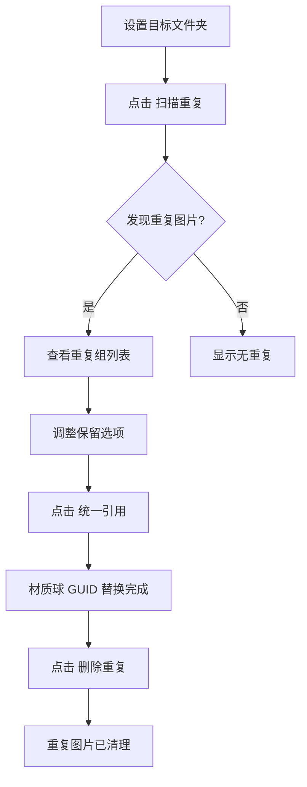

# 图片查重与材质球引用统一 - 设计方案

## 一、功能概述

为 `Moshi_RefCounter` 工具新增图片查重功能，实现：
1. 扫描目标文件夹内的重复图片（基于文件内容哈希）
2. 统一材质球中对重复图片的引用（GUID 替换）
3. 删除重复的图片文件

## 二、技术方案

### 2.1 查重算法

```
1. 遍历目标文件夹所有贴图文件（.png, .jpg, .tga, .psd, .tif 等）
2. 计算每张图片的 MD5 哈希值
3. 按哈希值分组，找出重复的图片组
4. 每组中按以下优先级选择默认保留图片：
   - 被引用次数最多
   - 文件名/路径最短
```

### 2.2 引用统一流程

```
1. 用户确认每组要保留的图片
2. 扫描目标文件夹内所有 .mat 文件
3. 读取材质球文件内容，将重复图片的 GUID 替换为保留图片的 GUID
4. 可选：删除重复的图片文件
```

## 三、UI 设计

位于「分步操作 & 高级设置」折叠区内：

```
🔍 图片查重
  ├─ [扫描重复] [统一引用] [删除重复] [清空结果]
  ├─ 统计：发现 X 组重复，共 Y 张可清理，预计释放 Z MB
  └─ 重复图片列表（可折叠）
       ├─ 组1: texture_A.png (3个重复)
       │   ├─ ● Assets/.../texture_A.png (保留) [3次引用]
       │   ├─ ○ Assets/.../copy_A.png [1次引用] [定位]
       │   └─ ○ Assets/.../backup/A.png [0次引用] [定位]
       └─ 组2: ...
```

## 四、数据结构

```csharp
// 图片哈希记录
private class TextureHashRecord
{
    public string AssetPath;      // 资源路径
    public string Hash;           // MD5 哈希
    public long FileSize;         // 文件大小
    public int ReferenceCount;    // 被引用次数
    public bool IsSelected;       // 是否选为保留
}

// 重复图片组
private class DuplicateTextureGroup
{
    public string Hash;                      // 哈希值（组标识）
    public List<TextureHashRecord> Textures; // 组内所有图片
    public string SelectedTexturePath;       // 被选中保留的图片路径
}
```

## 五、核心方法

| 方法名 | 功能描述 |
|-------|---------|
| `ScanDuplicateTextures()` | 扫描并计算所有贴图的哈希值，按哈希分组 |
| `CalculateFileHash(string path)` | 计算文件 MD5 哈希值 |
| `GetTextureReferenceCount(string path)` | 获取贴图被材质球引用的次数 |
| `UnifyTextureReferences()` | 统一材质球引用（GUID 替换） |
| `DeleteDuplicateTextures()` | 删除重复图片（保留选中项） |
| `DrawDuplicateTextureSection()` | 绘制 UI 区域 |

## 六、使用流程



## 七、代码位置

- 文件：`Assets/Editor/ToolsIntegrationPanel/AllToolsResources/Moshi_RefCounter.cs`
- 位置：在 `#region 一键资源整理` 之前添加 `#region 图片查重与引用统一`
- 预计代码量：约 400 行

## 八、复用现有方法

| 方法 | 用途 |
|-----|------|
| `ReplaceMultipleGuidsInTextAsset()` | GUID 批量替换 |
| `ConvertAssetPathToAbsolutePath()` | 路径转换 |
| `FormatFileSize()` | 文件大小格式化 |
| `IsTextSerializedAsset()` | 判断是否可文本编辑 |
| `GetFolderPath()` | 获取文件夹路径 |

## 九、支持的图片格式

```csharp
private static readonly HashSet<string> TextureFileExtensions = new HashSet<string>
{
    ".png", ".jpg", ".jpeg", ".tga", ".psd", 
    ".tif", ".tiff", ".bmp", ".gif", ".exr", ".hdr"
};
```

## 十、状态

✅ 已完成

---

*创建日期：2026-01-31*
*最后更新：2026-01-31*
*实现日期：2026-01-31*
